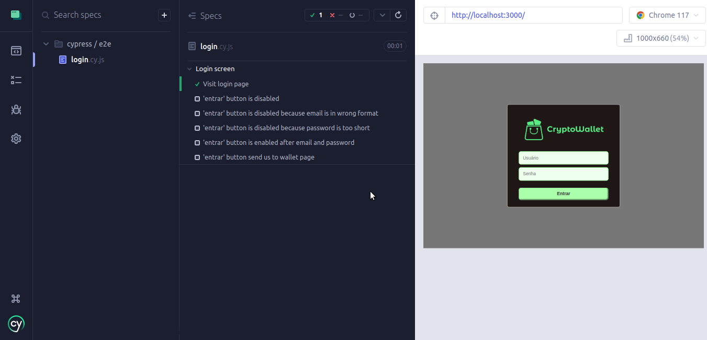

# Boas vindas ao CryptWallet

<h2 id="screens">Abaixo, você pode conferir algumas telas do projeto testadas automaticamente no cypress</h2>

  ### Login Screen
  

  </br>

  # Sumário:

- [Telas do projeto](#screens)
- [Instalação e ambiente](#instalacao)

<h1 id="instalacao">Instalação e ambiente</h1>

###### Os requisitos para usar o projeto localmente são:

- NPM ou Yarn

###### Use os seguintes comandos para iniciar o projeto:

- Clone o projeto em sua máquina

```git clone git@github.com:manupilation/Crypt-Wallet-With-Next-and_Cypress.git```

---

- Abra o diretório clonado é instale as dependências ($ pode ser tanto npm quanto Yarn):

```$ install```

---

- Rode o projeto (por padrão na porta 3000, modifique se necessário):

```npm run dev```  
ou  
```yarn dev```


---

### Se você deseja testar usando o Cypress, Rode o projeto e depois o comando:

```npm run cypress```  
ou  
```yarn cypress```
